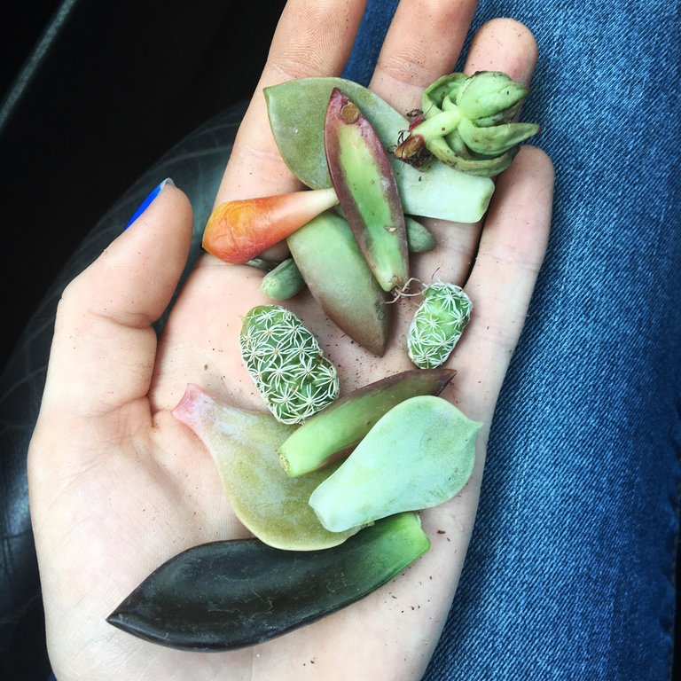
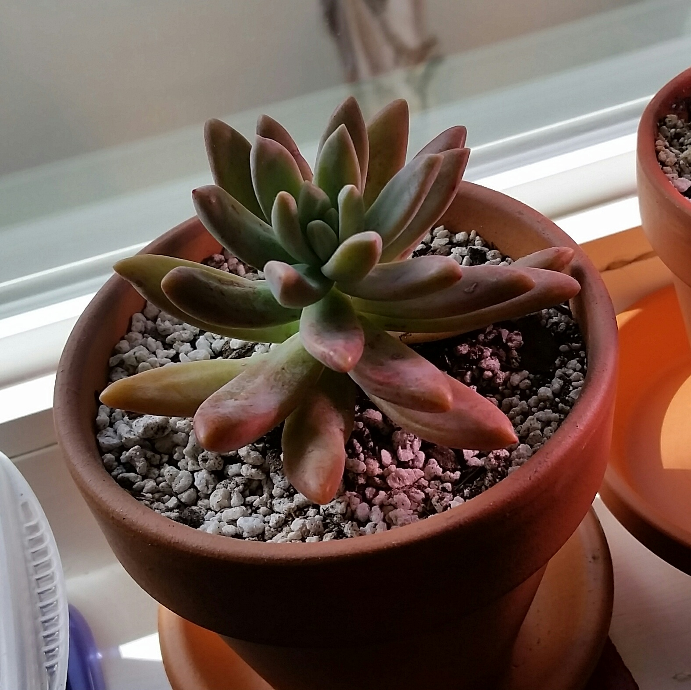

# Final-Game-Repo
The repo for the final game project for Intro to Game Development

[Trello board](https://trello.com/b/Jq1zLibC/proplift-working-title) for this game

## PROPOSAL
---

For my Final Game, I'm planning on extending the mod for the Puzzle unit. In my original mod, I made an adjustment to the swapping mechanic, such that the player was no longer a tile on the board, and instead the player object was a "holder" for a 2x2 object. I also swapped the tiles in a clockwise/anticlockwise direction as the main mechanic for movement. This was primarily influenced by the flash game Goparokko in the Neopets Games Room. Some ways that I think that I can extend this mechanic are:

1. a time-based combo meter
    - A meter visibly decreases the multiplier for the score after winning a match.
    - i.e, it is initially at 4x, after 10 seconds it decreases to 2x, and then to 1x after some more time.
2. (OR) A "finesse" punisher
    - In the spirit of the original game, make point gains lessen the more you make moves (player movement, tile swapping)
3. An overall time limit
    - The original mod did not have a game over state, because it was highly unpolished.
    - An arbitrarily chosen time limit for different difficulty modes. 
4. "Budding plants"
    - Some plants can't be used in a match until a match has been made of the same color. Then they will fully grow
5. Plants are matched in a 2x2 pattern, more like Goparokko
    - Seems like a pain in the butt honestly but it seems too easy with the 3x1 matching style.

I need to draw more varieties of succulents as well, and better communicate visually that they are succulents and not like crysanthemums or something. I'm going to add more juice, taking Jenny's suggestion of the plants growing out of the ground instead of dropping in. Adjusting the particle effect of the leaf explosion to be more visually striking. Making plants rustle to add some visual flair. And draw a clear UI. Furthermore, the sound design of the game should be relaxing. The thing is, I don't really listen to music that I would consider relaxing, so I would actively need to seek it out.

## VISUAL REFS

    
